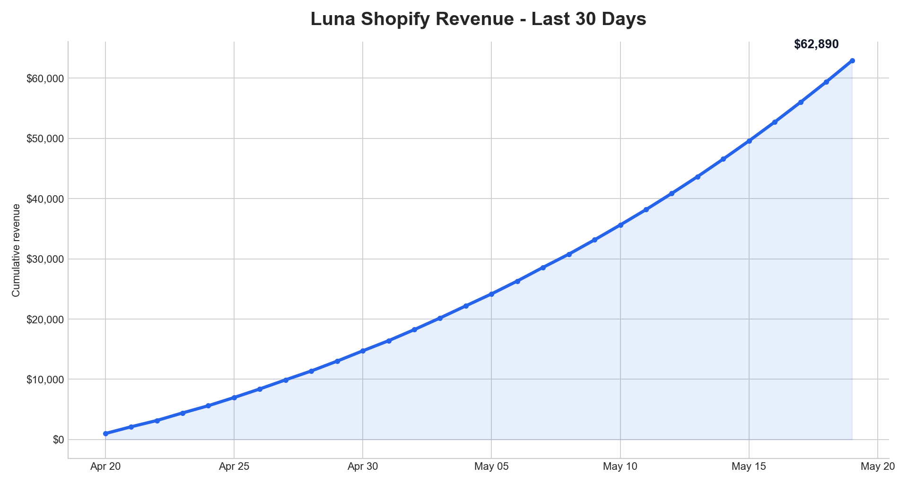

# Astro Commerce

Astro Commerce is a Codex/OpenClaw skill and Python CLI for pulling, syncing, charting, and inspecting commerce data across Astropad sales channels.

It supports:

- Shopify sales and inventory
- Amazon Seller Central sales and inventory through SP-API
- Stripe sales
- App Store Connect sales
- FastSpring sales
- SQLite sync for unified reporting
- CSV/table/JSON/records output
- Demo-safe masked output
- Inventory alert calculations

## Quick Start

Clone the repo and install Python dependencies:

```bash
git clone https://github.com/AstroHQ/astro-commerce.git
cd astro-commerce
python3 -m pip install --user -r requirements.txt
```

Run the CLI directly from the repo:

```bash
scripts/astro-commerce doctor
scripts/astro-commerce --demo shopify sales --days 30 --group sku
scripts/astro-commerce --demo sync run --days 30
```

To install command shims into your local workspace:

```bash
scripts/astro-commerce install --with-deps
```

After installation:

```bash
astro-commerce doctor
astro-commerce --demo amazon inventory --output records
```

## Common Commands

```bash
astro-commerce shopify sales --days 30 --match "luna" --group sku
astro-commerce amazon sales --days 7 --group day
astro-commerce stripe sales --days 30 --group sku
astro-commerce appstore sales --yesterday --group sku
astro-commerce fastspring sales --yesterday --group sku-day
astro-commerce sync run --channel all --days 7
astro-commerce inventory-alerts --output json
```

## Examples and Output

Longer runnable examples live in [demo/](demo/), including Slack webhook posting, chart generation, composable ETL, and daily report scripts.

### Sales by SKU

```bash
astro-commerce --demo shopify sales --days 7 --group sku
```

Representative output:

```text
+----------------------+-------+-----------+
| SKU                  | Units | Revenue   |
+----------------------+-------+-----------+
| luna-display-usb-c   |    42 | $4,117.82 |
| rpp-ipad-pro-13      |    31 | $2,904.15 |
| fresh-coat-13        |    18 | $1,026.40 |
| TOTAL                |    91 | $8,048.37 |
+----------------------+-------+-----------+
```

### Daily Report Pipeline

```bash
demo/scripts/daily-revenue-report.sh
```

Representative output:

```text
Sales synced: amazon OK, shopify OK, stripe OK, appstore OK, fastspring OK (2026-05-18)
Inventory synced: amazon OK, shopify OK (2026-05-19)
shopify|$12,418.92|217
amazon|$8,734.11|164
stripe|$2,129.00|38
appstore|$1,840.52|93
fastspring|$1,112.45|12
```

### Slack Report Hook

```bash
export SLACK_WEBHOOK_URL="<your Slack incoming webhook URL>"
demo/scripts/slack-daily-report.sh
```

Slack message shape:

```text
*Daily commerce report*
- shopify: $12,418.92 / 217 units
- amazon: $8,734.11 / 164 units
- stripe: $2,129.00 / 38 units
- appstore: $1,840.52 / 93 units
- fastspring: $1,112.45 / 12 units
```

### Inventory Alert Digest

```bash
demo/scripts/inventory-alerts-slack.sh
```

Representative Slack output:

```text
*Inventory alerts*
- HIGH shopify / ITB / rpp-ipad-pro-13: 6 days remaining, reorder 240 units
- MED amazon / FBA / luna-display-usb-c: 13 days remaining, reorder 120 units
- WATCH shopify / Warehouse / fresh-coat-13: 24 days remaining
```

### Product Trend Chart

```bash
PRODUCT_MATCH=luna CHANNEL=shopify OUT=luna-shopify-30d.png demo/scripts/product-trend-chart.sh
```

Representative output:

```text
Wrote luna-shopify-30d.png
```



### Composable ETL

```bash
CHANNEL=stripe demo/scripts/composable-etl.sh
```

Representative records payload:

```json
{
  "schema": "astro.commerce.sales.v1",
  "channel": "stripe",
  "records": [
    {
      "date": "2026-05-18",
      "sku": "studio-yearly",
      "units": 12,
      "revenue": 779.88
    }
  ],
  "summary": {
    "units": 12,
    "revenue": 779.88
  }
}
```

Use `--demo` to mask sales, revenue, unit, and inventory numbers with deterministic demo values:

```bash
astro-commerce --demo shopify sales --days 30 --group sku
astro-commerce --demo sync run --days 30
```

Demo sync writes to `~/.ecom-sales-demo.db` by default. Use `--db PATH` or `ECOM_DEMO_DB_PATH` to choose another database.

## Configuration

Configure the default SQLite database:

```bash
astro-commerce configure --db ~/.ecom-sales.db
```

Credential files and environment variables are intentionally not committed. Channel setup is documented here:

- [Shopify sales](docs/shopify-revenue.md)
- [Shopify inventory](docs/shopify-stock.md)
- [Amazon sales](docs/amazon-revenue.md)
- [Amazon inventory](docs/amazon-stock.md)
- [Stripe](docs/stripe.md)
- [App Store Connect](docs/app-store.md)
- [FastSpring](docs/fastspring.md)

## Output Formats

Most source commands support:

- `table` for terminal output
- `csv` for spreadsheets and charting
- `json` for structured inspection
- `records` for piping into `astro-commerce sync ingest`

Example:

```bash
astro-commerce shopify sales --yesterday --output records | astro-commerce sync ingest
```

## Inventory Alerts

`astro-commerce inventory-alerts` calculates action items from synced sales and inventory data:

```bash
astro-commerce inventory-alerts
astro-commerce inventory-alerts --days 30 --output slack
astro-commerce inventory-alerts --channel shopify --location "ITB" --hide-sku old-sku
```

See [database-schema.md](docs/database-schema.md) and [sync.md](docs/sync.md) for how synced data is stored.

## Tests

Run the offline test suite:

```bash
python3 -m unittest discover -s tests
```

Live API smoke tests are opt-in and skip channels without credentials:

```bash
python3 tests/test_astro_commerce_smoke.py --live
python3 tests/test_astro_commerce_smoke.py --live --channels shopify,stripe
```

## Skill Usage

For Codex/OpenClaw skill installation, this repository root is the skill directory. The skill manifest and agent instructions live in [SKILL.md](SKILL.md).

When calling from an agent without installing shims, prefer repo-relative commands:

```bash
{baseDir}/scripts/astro-commerce doctor
{baseDir}/scripts/astro-commerce sync run --channel all --days 7
```
